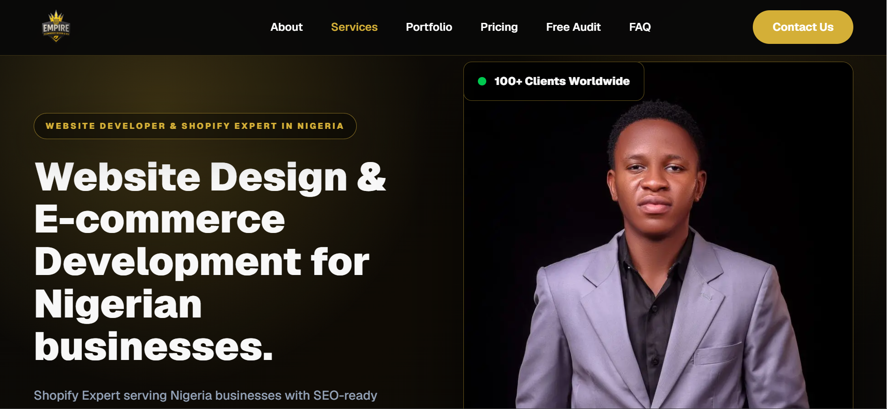
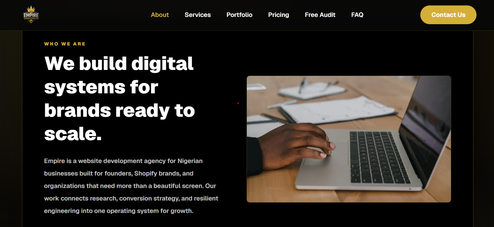

# Empire Growth Agency

## Live Website

https://www.theempiregrowth.com

---

## Overview

Empire Growth is a web development and digital growth agency focused on helping businesses improve their online presence through modern websites, SEO, and conversion-focused design.

This project was built using Next.js, TypeScript, and Tailwind CSS with a focus on performance, responsiveness, and lead generation.

---

## Features

- Responsive modern UI
- Dynamic geolocation-based keyword personalization
- Portfolio showcase
- SEO optimization
- Mobile-first design
- Fast page performance
- Lead generation forms

---

## Tech Stack

- Next.js
- TypeScript
- Tailwind CSS
- Vercel

---

## Screenshots

### Homepage

### About Page

---

## Key Learning Outcomes

This project strengthened my experience in:

- Next.js application development
- TypeScript
- SEO implementation
- Dynamic content rendering
- Responsive design
- Performance optimization

---

## Author

Peter Aderinto

Frontend Developer • Ecommerce Systems Builder • Digital Growth Strategist
